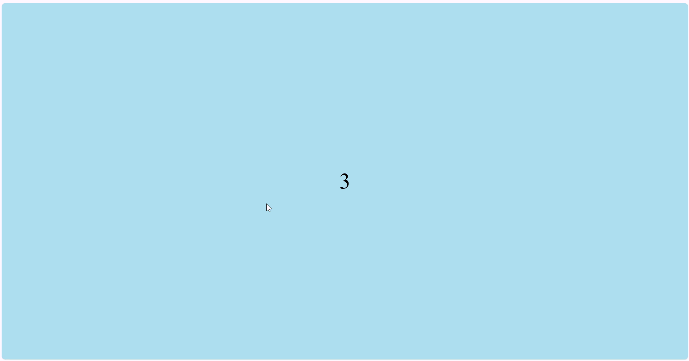
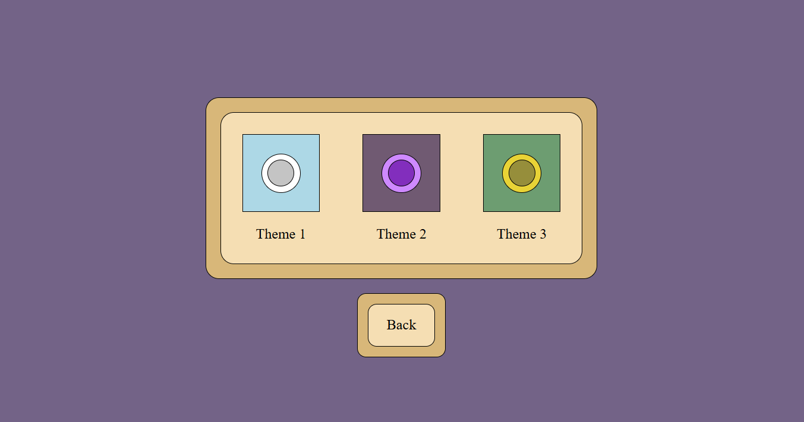

# aim-practice
A browser-based web game that lets players improve their mouse accuracy and reaction time.

  

## Project Reasoning / Learning Outcomes
I built this project using HTML, CSS, and Javascript to deepen my understanding of the core languages of the web. Through this project, I've learned to manage dynamic DOM elements for real-time interactivity, implement hit detection with event listeners, and perform coordinate calculations using Javascript. I also gained experience creating responsive layouts and styling with CSS to ensure a smooth user experience. Overall, this project helped solidify my skills required for building real-time browser applications.
